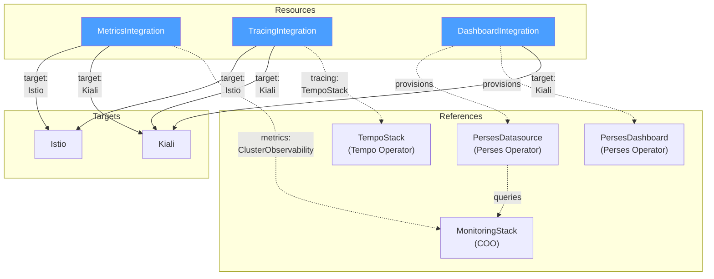

|Status                                             | Authors      | Created    | 
|---------------------------------------------------|--------------|------------|
| WIP                                               | @nrfox       | 2026-07-22 |

# Integrations API

## Overview
Configuring Istio to work with various integrations, especially on OpenShift, often requires following rote procedures that are easy to get wrong. This SEP defines the **Integrations API** — new CRDs and controller behavior to simplify that wiring while giving users full control over their resources.

This SEP also documents **Perses dashboard and datasource productization** as a separate OSSM deliverable. Productization covers the Istio `PersesDashboard` and `PersesDatasource` definitions Red Hat ships, versions, and tests. The Integrations API provides the `DashboardIntegration` CRD that provisions those resources and wires Kiali; the productization sections define the bundled content, datasource wiring to Thanos/COO metrics, and the supported OpenShift environment.

## Goals
- Simplify integrations with Istio, especially on OpenShift
- Allow for full customization without fighting against a controller

## Non-goals
- Modifying the existing Istio CRD.

## Design

Note that the Integrations controller detailed below will be the same one implemented as part of the [metrics integration SEP](https://github.com/istio-ecosystem/sail-operator/pull/2028). See the Implementation Plan for more details.

A new Integrations controller will be introduced along with new `Integration` types. Each type will be grouped by function. The `Integration` types will have a `targetRefs` field that specifies the resources the integration configures. Each target reference specifies the `kind` (e.g. `Istio`, `Kiali`), `name`, and optionally `namespace` of the target resource. A single `Integration` resource can target multiple resources, such as both an `Istio` and a `Kiali` resource. The Integration controller will configure the target resources and any other resources necessary to manage the integration based on which integrations are configured. For example, a UWM integration would look like this:
```yaml
kind: MetricsIntegration
apiVersion: sailoperator.io/v1alpha1
metadata:
  name: openshift-obserability
spec:
  targetRefs:
    - kind: Istio
      name: default
    - kind: Kiali
      name: kiali
      namespace: istio-system
  type: UserWorkloadMonitoring
  userWorkloadMonitoring: {}
```
A COO integration would look like this:
```yaml
kind: MetricsIntegration
apiVersion: sailoperator.io/v1alpha1
metadata:
  name: openshift-obserability
spec:
  targetRefs:
    - kind: Istio
      name: default
  type: ClusterObservabilityOperator
  clusterObservabilityOperator:
    monitoringStackRef:
      name: my-custom-prom
      namespace: custom-metrics
```
the Integrations controller would use the `monitoringStackRef` to reference the `MonitoringStack` for the prometheus instance and copy over any relevant fields such as the `resourceSelector` labels needed for the controller to label the `PodMonitor` and `ServiceMonitor` resources correctly.

Integrating with OpenShift COO and distributed tracing would involve a `MetricsIntegration` and a `TracingIntegration`:
```yaml
kind: MetricsIntegration
apiVersion: sailoperator.io/v1alpha1
metadata:
  name: openshift-obserability
spec:
  targetRefs:
    - kind: Istio
      name: default
  type: ClusterObservabilityOperator
  clusterObservabilityOperator:
    monitoringStackRef:
      name: my-custom-prom
      namespace: custom-metrics
---
kind: TracingIntegration
apiVersion: sailoperator.io/v1alpha1
metadata:
  name: openshift-obserability
spec:
  targetRefs:
    - kind: Istio
      name: default
  type: OpenTelemetry
  openTelemetry:
    otelCollectorRef:
      name: otel
      namespace: istio-system
```

The controller would then configure the following fields on the `Istio` and `Telemetry` resources:
```yaml
kind: Istio
apiVersion: sailoperator.io/v1
metadata:
  name: default
spec:
  values:
    meshConfig:
      enableTracing: true
      extensionProviders:
      - name: otel
        opentelemetry:
          port: 4317
          service: otel-collector.istio-system.svc.cluster.local
---
apiVersion: telemetry.istio.io/v1
kind: Telemetry
metadata:
  name: otel-demo
  namespace: istio-system
spec:
  metrics:
    - providers:
      - name: prometheus
  tracing:
    - providers:
        - name: otel
```

### Dealing with conflicts

A key part of the design is using **Server Side Apply** for all controller updates to resources. This will allow the Integrations controller to manage the fields of the `Istio` and `Telemetry` resources necessary to setup the integration while allowing users to manage other parts of the resources without users fighting against the controller. If users want to take full control over some of the controller managed fields, they can also do this cleanly with Server Side Apply. When [dealing with conflicts](https://kubernetes.io/docs/reference/using-api/server-side-apply/#conflicts), the controller will either give up management or become a shared manager. The controller will never overwrite values specified by the user or other controllers.

For users that manage their resources through Argo CD, the [Server Side Apply sync option](https://argo-cd.readthedocs.io/en/stable/user-guide/sync-options/#server-side-apply) must be enabled. This will cause Argo CD to use `kubectl apply --server-side --force-conflicts` and any fields that are written by both the Integrations controller and Argo CD will be owned by Argo CD. Since Server Side Apply is a stable, mature feature, it's assumed that other gitops solutions support a similar option.

### User Stories

- A mesh admin wants to configure Istio to work with UserWorkloadMonitoring on OpenShift. The admin wants Istio to work with UserWorkloadMonitoring without having to do any manual steps.
- A mesh admin wants to configure Kiali to read from UserWorkloadMonitoring and distributed tracing without having to perform any manual steps.
- A mesh admin wants to maintain full control over the configuration of all resources in case any customizations are needed.

### API Changes

Three new CRDs will be added corresponding broadly to different integration types for Istio. These can be added separately and new `type` for each group added over time but it's not expected that we will add many new `Integration` CRDs. The new CRDs and subtypes are:

- `MetricsIntegration`
  - UserWorkloadMonitoring
  - ClusterObservabilityOperator
  - PrometheusOperator
- `TracingIntegration`
  - OpenTelemetry
  - TempoStack
- `CertificateIntegration`
  - ZeroTrustWorkloadIdentityManagement
  - IstioCSR
  - CertManager
- `DashboardIntegration`
  - IstioPersesDashboards

Each `Integration` resource has a `targetRefs` field that specifies the resources the integration configures. Each target reference specifies the `kind` (e.g. `Istio`, `Kiali`), `name`, and optionally `namespace` of the target resource. A single `Integration` resource can target multiple resources, such as both an `Istio` and a `Kiali` resource. If there are multiple `Integration` resources of the same Kind that target the same ref, the one that is created later is considered invalid and this will be reflected in the status. 

Here are examples of each type:

A `MetricsIntegration` targeting Istio, Kiali, and Perses for UWM:
```yaml
kind: MetricsIntegration
apiVersion: sailoperator.io/v1alpha1
metadata:
  name: openshift-observability
spec:
  targetRefs:
    - kind: Istio
      name: default
    - kind: Kiali
      name: kiali
      namespace: istio-system
    - kind: Perses
      name: perses
      namespace: monitoring
  type: UserWorkloadMonitoring
  userWorkloadMonitoring: {}
```

A `TracingIntegration` targeting both Istio and Kiali:
```yaml
kind: TracingIntegration
apiVersion: sailoperator.io/v1alpha1
metadata:
  name: openshift-observability
spec:
  targetRefs:
    - kind: Istio
      name: default
    - kind: Kiali
      name: kiali
      namespace: istio-system
  type: TempoStack
  tempoStack:
    tempoStackRef:
      name: tempo
      namespace: tracing
```

Using the resources above, the controller would configure the following on the `Kiali` resource:
```yaml
apiVersion: kiali.io/v1alpha1
kind: Kiali
metadata:
  name: kiali
  namespace: istio-system
spec:
  external_services:
    prometheus:
      auth:
        type: bearer
        use_kiali_token: true
      thanos_proxy:
        enabled: true
      url: https://thanos-querier.openshift-monitoring.svc.cluster.local:9091
    tracing:
      enabled: true
      provider: tempo
      use_grpc: false
      internal_url: https://tempo-sample-gateway.tempo.svc.cluster.local:8080/api/traces/v1/default/tempo
      external_url: https://tempo-sample-gateway-tempo.apps-crc.testing/api/traces/v1/default/search 
      health_check_url: https://tempo-sample-gateway-tempo.apps-crc.testing/api/traces/v1/default/tempo/api/echo
      auth: 
        ca_file: /var/run/secrets/kubernetes.io/serviceaccount/service-ca.crt
        insecure_skip_verify: false
        type: bearer
        use_kiali_token: true
      tempo_config:
         url_format: "jaeger"
```

Integrating Istio with Zero Trust Workload Identity Management:
```yaml
kind: CertificateIntegration
apiVersion: sailoperator.io/v1alpha1
metadata:
  name: ztwim
spec:
  targetRefs:
    - kind: Istio
      name: default
  type: ZeroTrustWorkloadIdentityManagement
  ztwim: {}
```

Integrating Istio with Istio CSR:
```yaml
kind: CertificateIntegration
apiVersion: sailoperator.io/v1alpha1
metadata:
  name: istio-csr
spec:
  targetRefs:
    - kind: Istio
      name: default
  type: IstioCSR
  istioCSR:
    istioCSRRef:
      name: default
      namespace: istio-csr
```

#### DashboardIntegration

`DashboardIntegration` is the Integration CRD for dashboard wiring. The first supported subtype is `IstioPersesDashboards`, which provisions productized `PersesDatasource` and `PersesDashboard` custom resources and optionally patches Kiali `external_services.perses` for deep links.

Dashboard and datasource **content** is not defined in this API section. See [Perses Dashboard and Datasource Productization](#perses-dashboard-and-datasource-productization) for vendored artifacts, Thanos/COO datasource defaults, versioning, and the supported OpenShift environment. The Integrations controller reconciles `DashboardIntegration` by applying that productized content when the Perses API is available. The controller provisions the datasource before dashboards so queries resolve at install time.

Provisioning Perses resources and wiring Kiali may use separate `DashboardIntegration` resources. When `targetRefs` includes `Kiali`, the controller patches Kiali for deep links. When `targetRefs` is omitted or empty, the controller only provisions Perses custom resources:

```yaml
# Provisions productized PersesDatasource and PersesDashboard CRs (no targetRefs).
kind: DashboardIntegration
apiVersion: sailoperator.io/v1alpha1
metadata:
  name: istio-perses-dashboards
spec:
  type: IstioPersesDashboards
  istioPersesDashboards:
    persesNamespace: perses-dev
---
# Configures Kiali external_services.perses for deep links (targetRefs: Kiali).
kind: DashboardIntegration
apiVersion: sailoperator.io/v1alpha1
metadata:
  name: kiali-perses-links
spec:
  targetRefs:
    - kind: Kiali
      name: kiali
      namespace: istio-system
  type: IstioPersesDashboards
  istioPersesDashboards:
    persesNamespace: perses-dev
```

The `persesNamespace` field specifies the namespace where `PersesDatasource` and `PersesDashboard` resources are created. The Perses Operator maps Kubernetes namespaces to Perses projects; this value is also used as the Kiali `external_services.perses.project` field. It must match the Perses project namespace configured by COO on OpenShift.

When `datasourceRef` is set, the controller does not create a productized datasource and uses the referenced `PersesDatasource` instead. When omitted, the controller provisions the productized datasource (see [Perses Datasource Productization](#perses-datasource-productization)).

When `dashboards` is omitted, all six productized Istio Perses dashboards are installed. Users may select a subset:

```yaml
spec:
  type: IstioPersesDashboards
  istioPersesDashboards:
    persesNamespace: perses-dev
    dashboards:
      - Service
      - Workload
```

Using the `DashboardIntegration` with `targetRefs` targeting Kiali above, the controller would configure the following on the `Kiali` resource (see [Kiali Perses configuration](https://kiali.io/docs/configuration/p8s-jaeger-grafana/perses/)):

```yaml
apiVersion: kiali.io/v1alpha1
kind: Kiali
metadata:
  name: kiali
  namespace: istio-system
spec:
  external_services:
    perses:
      enabled: true
      internal_url: http://perses.perses-dev:4000/
      external_url: https://perses-perses-dev.apps.example.com
      project: perses-dev
      dashboards:
        - name: "Istio Service Dashboard"
          variables:
            namespace: "var-namespace"
            service: "var-service"
        - name: "Istio Workload Dashboard"
          variables:
            namespace: "var-namespace"
            workload: "var-workload"
        - name: "Istio Mesh Dashboard"
        - name: "Istio Ztunnel Dashboard"
          variables:
            namespace: "var-namespace"
            workload: "var-workload"
```

On OpenShift, `url_format` and authentication settings for Perses may differ from vanilla Kubernetes and will be set by the controller based on platform detection.

Before creating `PersesDashboard` or `PersesDatasource` resources, the Integrations controller must detect that the Perses CRDs are installed (typically `perses.dev/v1alpha2`). If the CRDs are not present, the controller does not attempt to create Perses resources and reports a status condition on the `DashboardIntegration` resource:

| Field | Value |
|-------|-------|
| `type` | `PersesAvailable` |
| `status` | `False` |
| `reason` | `MissingCRDs` |
| `message` | `PersesDashboard CRD not found` |

This follows the same pattern as `MetricsIntegration` detection of `ServiceMonitor` and `PodMonitor` CRDs. Sail Operator never installs the Perses Operator; it only creates custom resources when the API is available.

When reconciling `PersesDatasource` and `PersesDashboard` resources, the controller uses Server Side Apply so users can customize datasource URLs, authentication, or dashboard queries without fighting the controller. If a user takes full ownership of a resource, the controller becomes a shared manager or gives up management of conflicting fields.


These are broadly what the golang API changes would be:
```go
// TargetReference identifies a resource that the integration configures.
type TargetReference struct {
	// Kind specifies the kind of resource (e.g. "Istio", "Kiali").
	Kind string `json:"kind"`

	// Name is the name of the target resource.
	Name string `json:"name"`

	// Namespace is the namespace of the target resource.
	// Only required for namespace-scoped resources like Kiali.
	Namespace string `json:"namespace,omitempty"`
}

// MetricsIntegrationSpec defines the desired state of MetricsIntegration.
type MetricsIntegrationSpec struct {
	// TargetRefs specifies the resources that this integration configures.
	TargetRefs []TargetReference `json:"targetRefs"`

	MetricsConfig `json:",inline"`
}

// MetricsType identifies the type of metrics integration.
type MetricsType string

const (
	MetricsTypeUserWorkloadMonitoring      MetricsType = "UserWorkloadMonitoring"
	MetricsTypeClusterObservabilityOperator MetricsType = "ClusterObservabilityOperator"
)

// MetricsConfig configures a metrics backend.
type MetricsConfig struct {
	// Type specifies the metrics integration type.
	Type MetricsType `json:"type"`

	// UserWorkloadMonitoring configures integration with OpenShift User Workload Monitoring.
	UserWorkloadMonitoring *UserWorkloadMonitoringConfig `json:"userWorkloadMonitoring,omitempty"`

	// ClusterObservabilityOperator configures integration with the Cluster Observability
	// Operator's MonitoringStack resource for metrics collection.
	ClusterObservabilityOperator *ClusterObservabilityOperatorConfig `json:"clusterObservabilityOperator,omitempty"`
}

type UserWorkloadMonitoringConfig struct{}

// ClusterObservabilityOperatorConfig configures the Cluster Observability Operator integration.
type ClusterObservabilityOperatorConfig struct {
	// MonitoringStackRef is a reference to a MonitoringStack resource that defines
	// the Prometheus stack used for scraping Istio metrics.
	MonitoringStackRef NamespacedReference `json:"monitoringStackRef"`
}

// TracingIntegrationSpec defines the desired state of TracingIntegration.
type TracingIntegrationSpec struct {
	// TargetRefs specifies the resources that this integration configures.
	TargetRefs []TargetReference `json:"targetRefs"`

	TracingConfig `json:",inline"`
}

// TracingType identifies the type of tracing integration.
type TracingType string

const (
	TracingTypeOpenTelemetry TracingType = "OpenTelemetry"
	TracingTypeTempoStack    TracingType = "TempoStack"
)

// TracingConfig configures a tracing backend.
type TracingConfig struct {
	// Type specifies the tracing integration type.
	Type TracingType `json:"type"`

	// OpenTelemetry configures integration with an OpenTelemetry Collector.
	OpenTelemetry *OpenTelemetryConfig `json:"openTelemetry,omitempty"`

	// TempoStack configures integration with a TempoStack resource.
	TempoStack *TempoStackConfig `json:"tempoStack,omitempty"`
}

// OpenTelemetryConfig configures the OpenTelemetry integration.
type OpenTelemetryConfig struct {
	// OTELCollectorRef is a reference to an OpenTelemetry Collector resource.
	OTELCollectorRef NamespacedReference `json:"otelCollectorRef"`
}

// TempoStackConfig configures the TempoStack integration.
type TempoStackConfig struct {
	// TempoStackRef is a reference to a TempoStack resource.
	TempoStackRef NamespacedReference `json:"tempoStackRef"`
}

// CertificateIntegrationSpec defines the desired state of CertificateIntegration.
type CertificateIntegrationSpec struct {
	// TargetRefs specifies the resources that this integration configures.
	TargetRefs []TargetReference `json:"targetRefs"`

	// Type specifies the identity integration type.
	Type IdentityType `json:"type"`

	// ZTWIM configures integration with Zero Trust Workload Identity Management.
	ZTWIM *ZTWIMConfig `json:"ztwim,omitempty"`

	// IstioCSR configures integration with cert-manager istio-csr.
	IstioCSR *IstioCSRConfig `json:"istioCSR,omitempty"`
}

// IdentityType identifies the type of identity integration.
type IdentityType string

const (
	IdentityTypeZTWIM    IdentityType = "ZeroTrustWorkloadIdentityManagement"
	IdentityTypeIstioCSR IdentityType = "IstioCSR"
)

// ZTWIMConfig configures the Zero Trust Workload Identity Management integration.
type ZTWIMConfig struct{}

// IstioCSRConfig configures the cert-manager istio-csr integration.
type IstioCSRConfig struct {
	// IstioCSRRef is a reference to an IstioCSR resource.
	IstioCSRRef NamespacedReference `json:"istioCSRRef"`
}

// DashboardIntegrationSpec defines the desired state of DashboardIntegration.
type DashboardIntegrationSpec struct {
	// TargetRefs specifies the resources that this integration configures.
	// When omitted or empty, the controller only provisions Perses custom resources.
	TargetRefs []TargetReference `json:"targetRefs,omitempty"`

	DashboardConfig `json:",inline"`
}

// DashboardType identifies the type of dashboard integration.
type DashboardType string

const (
	DashboardTypeIstioPersesDashboards DashboardType = "IstioPersesDashboards"
)

// DashboardConfig configures a dashboard integration.
type DashboardConfig struct {
	// Type specifies the dashboard integration type.
	Type DashboardType `json:"type"`

	// IstioPersesDashboards configures the productized Istio Perses dashboards shipped with OSSM.
	IstioPersesDashboards *IstioPersesDashboardsConfig `json:"istioPersesDashboards,omitempty"`
}

// IstioPersesDashboardsConfig configures the productized Istio Perses dashboards integration.
type IstioPersesDashboardsConfig struct {
	// PersesNamespace is the namespace where PersesDatasource and PersesDashboard resources are created.
	// This namespace maps to the Perses project name and must match the COO Perses project.
	PersesNamespace string `json:"persesNamespace"`

	// Dashboards selects which productized Istio dashboards to install.
	// When omitted, all six dashboards shipped with OSSM are installed.
	Dashboards []IstioPersesDashboard `json:"dashboards,omitempty"`

	// DatasourceRef references an existing PersesDatasource to use instead of
	// provisioning the productized datasource. Must exist in persesNamespace.
	DatasourceRef *NamespacedReference `json:"datasourceRef,omitempty"`

	// Datasource selects which metrics backend the productized PersesDatasource uses.
	// When omitted, ClusterMonitoring (OpenShift Thanos querier) is the default on OpenShift.
	Datasource *PersesDatasourceIntegrationConfig `json:"datasource,omitempty"`
}

// PersesDatasourceIntegrationConfig configures the productized PersesDatasource.
type PersesDatasourceIntegrationConfig struct {
	// Type selects the Prometheus/Thanos endpoint for the datasource.
	Type PersesDatasourceType `json:"type,omitempty"`

	// MonitoringStackRef uses the Prometheus endpoint from a COO MonitoringStack.
	// Only valid when Type is MonitoringStack.
	MonitoringStackRef NamespacedReference `json:"monitoringStackRef,omitempty"`
}

// PersesDatasourceType selects the metrics backend for the productized datasource.
type PersesDatasourceType string

const (
	// PersesDatasourceTypeClusterMonitoring uses the OpenShift cluster monitoring Thanos querier.
	PersesDatasourceTypeClusterMonitoring PersesDatasourceType = "ClusterMonitoring"

	// PersesDatasourceTypeMonitoringStack uses a COO MonitoringStack Prometheus endpoint.
	PersesDatasourceTypeMonitoringStack PersesDatasourceType = "MonitoringStack"
)

// IstioPersesDashboard identifies a productized Istio Perses dashboard.
type IstioPersesDashboard string

const (
	IstioPersesDashboardControlPlane IstioPersesDashboard = "ControlPlane"
	IstioPersesDashboardMesh         IstioPersesDashboard = "Mesh"
	IstioPersesDashboardPerformance  IstioPersesDashboard = "Performance"
	IstioPersesDashboardService      IstioPersesDashboard = "Service"
	IstioPersesDashboardWorkload     IstioPersesDashboard = "Workload"
	IstioPersesDashboardZtunnel      IstioPersesDashboard = "Ztunnel"
)
```

#### Status
Integrations will report `Status`. Non-exhaustive list of what should be in `Status`:
- Validations: do the refs exist?
- Success/failure to update resources.
- Possibly report if the update was partially applied i.e. some other controller owns part of the fields.

#### Migration

Some users will already have configured their integrations. They may already have `PodMonitor` and `ServiceMonitor` resources created for example. How should the Integrations controller handles this?

The integrations controller could either:

1. Adopt the resources i.e. add the Integrations controller's OwnerRef to them. 
2. Do nothing.
3. Create parallel resources. In the case of `PodMonitor` creating a second `PodMonitor`.

The Integrations controller will implement option 3. and will create new resources regardless of any existing resources. This is the simplest option. Users who have already configured their integrations may not need this API and if they want to utilize this API they can remove their existing resources before or after creating the `Integration` resource.

#### Resource Ownership

The Integrations controller should own the resources that it directly creates as part of the integration. This will tie the lifecycle of these resources to the `Integration` ensuring resources are properly cleaned up when the `Integration` is removed. The Integrations controller will **not** put an `ownerRef` on any of the resources that it references. The Integrations controller will never put an `ownerRef` on an `Istio` resource or on an `OpenTelemetry` resource. 

#### Permissions

Adding this API will require adding new permissions to the Sail Operator for each `Integration`. In general, the Sail Operator will need `READ` permissions for all of the `Integration` types and subtypes, `PATCH` permissions for any `targetRef`, and `CREATE`/`PATCH` for all resources the Integrations controller creates e.g. `PodMonitor`. Other permissions may also be needed for different integrations.

Adding the Cluster Observability Operator integration would require adding:
- `GET`/`WATCH`/`LIST` for `MonitoringStack` resources
- `PATCH` for `Kiali` resources (the Sail Operator already has permission to patch `Istio` resources)
- `CREATE`/`PATCH` for `PodMonitor`/`ServiceMonitor` resources.

This will greatly increase the scope of the Sail Operator's Service Account but the operator already has full control of `Secret` and `ClusterRole`/`ClusterRoleBinding` resources effectively giving it cluster admin for the cluster.

### Architecture



### Performance Impact

The exact performance impact will partially depend on the implementation details of each integration type. For example, the UWM integration requires creating/watching more resources so it will likely have a greater impact but the tracing integration only requires updating some fields on the `Istio` resource and reconciling `Telemetry` objects.

### Kubernetes vs OpenShift vs Other Distributions

Some of this controller will only be applicable to OpenShift. The UWM and COO types are OpenShift specific but other types, such as `TempoStack` would be valid on either Kubernetes or OpenShift. `DashboardIntegration` with `IstioPersesDashboards` is reconciled on any cluster where Perses CRDs exist, but dashboard and datasource productization is only supported on OpenShift (see [Perses Dashboard and Datasource Productization](#perses-dashboard-and-datasource-productization)).

## Perses Dashboard and Datasource Productization

OpenShift Service Mesh GA requires a supported path to deploy Istio Perses dashboards, provision a Thanos/Prometheus datasource for those dashboards, wire metrics from the mesh observability stack, and connect Kiali deep links (OSSM-15316). This section defines that deliverable separately from the Integrations API. The API hook is `DashboardIntegration`; productization defines what Red Hat ships and where it is supported.

### Goals
- Productize the six Istio Perses dashboards as a supported OSSM deliverable: owned, versioned, tested dashboard content shipped in the Sail Operator bundle
- Productize the `PersesDatasource` required by those dashboards so panels and variables resolve without manual datasource setup
- Align dashboard queries with the Istio/Grafana addon set and target the correct OpenShift Thanos or COO `MonitoringStack` endpoint
- Enable opt-in deployment via `DashboardIntegration` without requiring users to fetch YAML from external repositories at runtime

### Non-goals
- Installing or managing the Perses Operator, Perses server, or COO
- Replacing Kiali metrics views; Perses provides advanced dashboard options and deep links from Kiali
- Productizing dashboards or datasources outside the initial Istio Perses OSSM deliverable
- Managing the cluster Thanos or Prometheus deployment itself; Sail only creates the `PersesDatasource` CR that points at an existing metrics endpoint

### User Stories

- A mesh admin on OpenShift wants the supported Istio Perses dashboards installed from OSSM-shipped content without manually applying community-mixins YAML or tracking upstream dashboard revisions.
- A mesh admin wants a supported `PersesDatasource` pointing at Thanos or COO Prometheus provisioned automatically so dashboard queries work out of the box.
- A mesh admin wants Kiali deep links to those dashboards configured automatically while retaining the ability to customize dashboard queries or datasource settings via SSA.

### Design

#### Perses dashboards

OSSM ships six Istio dashboards aligned with the Istio/Grafana addon set:

| Product dashboard | Perses display name |
|-------------------|---------------------|
| `ControlPlane` | Istio Control Plane Dashboard |
| `Mesh` | Istio Mesh Dashboard |
| `Performance` | Istio Performance Dashboard |
| `Service` | Istio Service Dashboard |
| `Workload` | Istio Workload Dashboard |
| `Ztunnel` | Istio Ztunnel Dashboard |

Dashboard YAML is **vendored into the Sail Operator repository** (e.g. `resources/perses/dashboards/`) and included in the operator bundle/OLM catalog. Each OSSM release pins a known dashboard revision. [perses/community-mixins](https://github.com/perses/community-mixins) is the upstream source for initial content and ongoing query updates; Red Hat productizes that content through vendoring, QA, and release versioning rather than requiring clusters to pull YAML from GitHub at runtime.

Productized dashboards carry Red Hat ownership labels (e.g. `app.kubernetes.io/part-of: sail-operator`) so upgrades reconcile to the shipped version while SSA still allows users to customize panels or queries without fighting the controller.

#### Perses Datasource Productization

Istio Perses dashboards from [perses/community-mixins](https://github.com/perses/community-mixins) reference a Prometheus datasource by name: `prometheus-datasource`. Every panel query and dashboard variable expects that datasource to exist in the same Perses project (Kubernetes namespace). Without it, dashboards install but show no data.

OSSM productizes a matching `PersesDatasource` CR:

| Field | Productized value |
|-------|-------------------|
| Resource name | `prometheus-datasource` (must match dashboard queries) |
| Namespace | Same as `persesNamespace` on `DashboardIntegration` |
| Bundle path | e.g. `resources/perses/datasources/prometheus-datasource.yaml` |
| Default on OpenShift | `ClusterMonitoring` → Thanos querier in `openshift-monitoring` |

The datasource YAML is vendored into the Sail Operator repository and included in the operator bundle/OLM catalog alongside the dashboards. Each OSSM release pins a known datasource revision (URL, auth, TLS).

**Default OpenShift endpoint (`datasource.type: ClusterMonitoring` or omitted):**

The productized datasource points at the cluster monitoring Thanos querier, consistent with `MetricsIntegration` Kiali prometheus wiring:

```yaml
apiVersion: perses.dev/v1alpha2
kind: PersesDatasource
metadata:
  name: prometheus-datasource
  namespace: perses-dev
  labels:
    app.kubernetes.io/part-of: sail-operator
spec:
  config:
    display:
      name: Prometheus
    default: true
    plugin:
      kind: PrometheusDatasource
      spec:
        proxy:
          kind: HTTPProxy
          spec:
            url: https://thanos-querier.openshift-monitoring.svc.cluster.local:9091
```

On OpenShift, the controller sets platform-appropriate authentication and TLS (e.g. bearer token, service CA) on the datasource proxy configuration. Exact fields will match what Perses and COO require on the supported stack.

**COO MonitoringStack endpoint (`datasource.type: MonitoringStack`):**

When Istio metrics are collected via a COO `MonitoringStack` rather than cluster monitoring, `DashboardIntegration` can select that endpoint:

```yaml
spec:
  type: IstioPersesDashboards
  istioPersesDashboards:
    persesNamespace: perses-dev
    datasource:
      type: MonitoringStack
      monitoringStackRef:
        name: my-custom-prom
        namespace: custom-metrics
```

The controller derives the Prometheus/Thanos URL from the referenced `MonitoringStack` (same integration surface as `MetricsIntegration` COO). This keeps dashboard queries and mesh metrics scraping aligned on one stack.

**Using an existing datasource (`datasourceRef`):**

If the cluster admin or COO already provisioned a `PersesDatasource`, users can reference it and skip productized datasource creation:

```yaml
spec:
  type: IstioPersesDashboards
  istioPersesDashboards:
    persesNamespace: perses-dev
    datasourceRef:
      name: my-thanos
      namespace: perses-dev
```

The referenced datasource name must match what the dashboards expect (`prometheus-datasource`), or users must use dashboards customized for a different datasource name. The productized dashboards are generated for `prometheus-datasource`; overriding the name is an advanced customization outside the default supported path.

**Reconciliation order:**

1. Detect `PersesDatasource` and `PersesDashboard` CRDs
2. Provision or skip datasource (`datasourceRef` → skip creation; otherwise apply productized `PersesDatasource` via SSA)
3. Provision productized `PersesDashboard` resources
4. Optionally patch Kiali (`targetRefs` includes `Kiali`)

#### Supported environment

Perses dashboard productization is supported only on **OpenShift** in an environment where:

- OpenShift Service Mesh (Sail Operator) is installed
- Cluster Observability Operator is installed with the Perses UI plugin enabled ([COO Perses documentation](https://docs.redhat.com/en/documentation/red_hat_openshift_cluster_observability_operator/1-latest/html/ui_plugins_for_red_hat_openshift_cluster_observability_operator/perses-dashboard))
- `PersesDashboard` and `PersesDatasource` CRDs are present (`perses.dev/v1alpha2`, installed by COO)
- A reachable Thanos or Prometheus endpoint exists for the chosen `datasource.type` (cluster monitoring or COO `MonitoringStack`)
- Kiali is installed when `targetRefs` includes `Kiali` on `DashboardIntegration` for deep links

On unsupported platforms (e.g. plain Kubernetes without Perses CRDs), the Integrations controller reports `PersesAvailable=False` with reason `MissingCRDs` and does not provision dashboards or datasources. This is expected.

#### Relationship to DashboardIntegration

Users opt in by creating `DashboardIntegration` resources (see [DashboardIntegration](#dashboardintegration) above). The controller applies productized datasource and dashboard content from the bundle; it does not download YAML at runtime. Typical resources:

1. `DashboardIntegration` without `targetRefs` — provisions productized `PersesDatasource` and `PersesDashboard` CRs
2. `DashboardIntegration` with `targetRefs` targeting `Kiali` — configures `external_services.perses`

Manual `oc apply` of upstream community-mixins YAML may serve as a temporary workaround during development but is not the productized OSSM path.

#
## Alternatives Considered
- The main alternative to having a separate CRD for the integrations is to add fields to the `Istio` spec directly. One drawback of this approach is that there isn't a clear separation of concerns. Today the istio controller alone reconciles the `Istio` spec. If the integrations controller began to reconcile parts of the `Istio` spec, care would need to be taken to ensure the two controllers do not fight with one another. Having a separate resources also allows the API to evolve and rapidly add new types without affecting the stable `Istio` API.

- Two types with many subtypes. In this scenario you would have a `IstioIntegration` type and a `KialiIntegration` type rather than grouping the integrations by their function.

  ```yaml
  kind: IstioIntegration
  apiVersion: sailoperator.io/v1alpha1
  metadata:
    name: openshift-obserability
  spec:
    istioRef:
      name: default
    metrics:
      type: ClusterObservabilityOperator
      clusterObservabilityOperator:
        monitoringStackRef:
          name: my-custom-prom
          namespace: custom-metrics
    tracing:
      type: OpenTelemetry
      openTelemetry:
        otelCollectorRef:
          name: otel
          namespace: istio-system
  ```
  
  The main disadvantage of this API is that you end up with a single large CR with many different fields and subtypes.

- No subtypes and only CRDs e.g.
  ```yaml
  kind: ClusterObservabilityOperator
  apiVersion: sailoperator.io/v1alpha1
  metadata:
    name: openshift-obserability
  spec:
    monitoringStackRef:
      name: my-custom-prom
      namespace: custom-metrics
  ```

  With this API you end up with a large number of CRDs that have very few fields.
- Extending `MetricsIntegration` with Perses dashboard provisioning (e.g. as a side effect of `ClusterObservabilityOperator`). Metrics integration concerns scraping configuration (`PodMonitor`, `ServiceMonitor`, Kiali prometheus settings). Perses dashboards are a visualization layer on top of metrics already collected. Combining them would couple scraping with dashboard lifecycle and complicate the API. A dedicated `DashboardIntegration` CRD keeps the separation of concerns consistent with metrics, tracing, and certificate integrations.

- Reintroducing a `dashboard` subfield on `MetricsIntegration` and `TracingIntegration` (as in an earlier revision of this SEP) with `type: Perses` and a `persesRef`. That approach was replaced by `targetRefs`. Perses is not a configuration target in the same sense as Istio or Kiali for dashboard provisioning; the controller creates `PersesDashboard` resources rather than patching a Perses custom resource spec. A separate `DashboardIntegration` kind with optional `targetRefs` better matches this behavior.

## Implementation Plan

### Integrations API

The implementation for UWM is already complete as part of the [monitoring controller](https://github.com/istio-ecosystem/sail-operator/pull/1959). The only user facing change would be switching the enablement from an annotation on the `Istio` resource to creating a separate `MetricsIntegration` resource. The monitoring controller implementation would change slightly to reconcile `MetricsIntegration` resources and use Server Side Apply to update the `Istio` and `Telemetry` resources. A rough timeline would be:

- [ ] Add `MetricsIntegration` CRD
- [ ] Update monitoring controller for UWM to reconcile `MetricsIntegration` resources.
- [ ] Add `TracingIntegration` CRD
- [ ] Add `CertificateIntegration` CRD
- [ ] Add a `Kiali` target on the `Integration` resources.

As an addition, in order to support the DashboardIntegrations:
- [ ] Add `DashboardIntegration` CRD with `IstioPersesDashboards` type
- [ ] Detect `perses.dev` CRDs before reconciling Perses resources
- [ ] Reconcile productized `PersesDatasource` before `PersesDashboard` resources (unstructured client / SSA)
- [ ] Kiali `targetRefs`: SSA `external_services.perses` on `DashboardIntegration`

### Perses Dashboard and Datasource Productization

- [ ] Vendor and bundle the productized `PersesDatasource` in `resources/perses/datasources/`
- [ ] Vendor and bundle the six Istio Perses dashboards in `resources/perses/dashboards/`
- [ ] Define dashboard and datasource versioning cadence aligned with OSSM releases (sync from community-mixins as needed)
- [ ] Include Perses artifacts in OLM/bundle generation
- [ ] Document supported OpenShift + COO environment and datasource endpoint options in OSSM user docs
- [ ] OpenShift e2e for Perses dashboard and datasource productization

## Test Plan

### Integrations API

- A key aspect of this design is utilizing Server Side Apply to ensure that users can override values that the operator sets if need be without fighting against the controller. This needs to be an integral part of the test suite and will be included in e2e testing. Specifically e2e testing should ensure that the operator can Apply a configuration partially and ignore any conflict errors.
- Some integration types will only be available on OpenShift, such as UWM and COO. e2e tests for these can only be run in an OpenShift environment. These will be filtered out of the kind based suite with the openshift label similar to the TLS profile tests.

### Perses Dashboard and Datasource Productization

- e2e tests run on OpenShift with COO and Perses CRDs installed.
- Verify unsupported environment handling when Perses CRDs are missing (`PersesAvailable=False`).
- Verify productized `PersesDatasource` is created with correct Thanos querier URL for `ClusterMonitoring`.
- Verify `MonitoringStack` datasource type uses the referenced COO stack endpoint.
- Verify `datasourceRef` skips productized datasource creation and dashboards still query successfully.
- Verify successful provisioning of all six bundled dashboards on the supported stack.
- Verify dashboard panels return data after datasource and `MetricsIntegration` scraping are in place.
- Verify Kiali deep links for Service and Workload metrics views.
- Verify dashboard and datasource content match the vendored OSSM revision on upgrade.
- Verify user-owned datasource and dashboard fields are not overwritten after SSA conflicts.

## Change History (only required when making changes after SEP has been accepted)
- Changed the API from `IstioIntegration` --> `<Component>Integration`.
- Replaced `istioRef` + `dashboard` fields with a unified `target` discriminated union (Istio | Kiali).
- Replaced `target` discriminated union with `targetRefs` array of references.
- Updated migration section to ignore any existing resources.
- Added `DashboardIntegration` CRD to the Integrations API (OSSM-15316).
- Added Perses dashboard and datasource productization as a separate section; integration type `IstioPersesDashboards`.