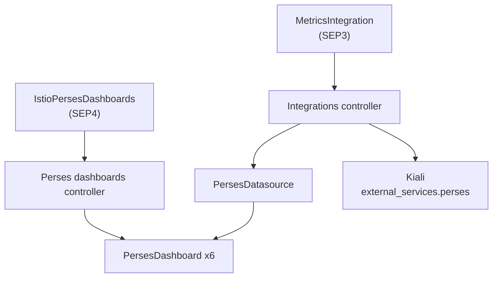

|Status                                             | Authors      | Created    |
|---------------------------------------------------|--------------|------------|
| WIP                                               |              | 2026-08-18 |

# Istio Perses Dashboard Productization

## Overview

OpenShift Service Mesh GA requires a supported path to deploy Istio Perses dashboards and connect them to mesh metrics (OSSM-15316). [SEP3-integrations.md](./SEP3-integrations.md) covers **metrics backend wiring**: when `MetricsIntegration` targets a Perses project, the Integrations controller provisions `PersesDatasource` aligned with User Workload Monitoring or COO `MonitoringStack`, and may patch Kiali `external_services.perses` for deep links.

This SEP covers **dashboard lifecycle**: what Red Hat ships, how `PersesDashboard` resources are created, and how dashboards reference the datasource provisioned by SEP3.

## Goals

- [ ] Define a supported path to install Istio Perses dashboards on OpenShift without users fetching YAML from external repositories at runtime.
- [ ] Productize the six Istio Perses dashboards aligned with the Istio/Grafana addon set as versioned content in the Sail Operator bundle.
- [ ] Ensure dashboard queries resolve against the `prometheus-datasource` created by `MetricsIntegration` (SEP3) in the same Perses project namespace.
- [ ] Allow opt-in deployment while preserving user customization via Server Side Apply.

## Non-goals

- Installing or managing the Perses Operator, Perses server, or Cluster Observability Operator (COO).
- Provisioning `PersesDatasource` resources (see [SEP3 Perses datasource](./SEP3-integrations.md#perses-datasource-metricsintegration)).
- Replacing Kiali metrics views; Perses provides advanced dashboards and deep links from Kiali.
- Managing cluster Thanos or Prometheus deployments; Sail only creates CRs that point at existing endpoints.
- A fourth `Integration` CRD (`DashboardIntegration` / `PersesIntegration`); dashboard reconciliation uses a dedicated controller path documented below.

## Relationship to SEP3

| Concern | SEP | Mechanism |
|---------|-----|-----------|
| `PersesDatasource` → UWM / COO Thanos | SEP3 | `MetricsIntegration` + `targetRefs` `kind: Perses` |
| Kiali deep links (`external_services.perses`) | SEP3 | `MetricsIntegration` + `targetRefs` `kind: Kiali` |
| `PersesDashboard` CRs (content + lifecycle) | SEP4 (this document) | Perses dashboards controller (see Design) |
| `PodMonitor` / `ServiceMonitor` | SEP3 | `MetricsIntegration` + `targetRefs` `kind: Istio` |

Typical user flow:

1. Create `MetricsIntegration` with `type: UserWorkloadMonitoring`, `targetRefs` for `Istio`, `Kiali`, and `Perses` (SEP3).
2. Opt in to dashboard installation via the API defined in this SEP (e.g. `IstioPersesDashboards` CR or equivalent).
3. Controller creates productized `PersesDashboard` resources; panels reference `prometheus-datasource` in the same namespace.

## Design

### User Stories

- [ ] As a mesh admin on OpenShift, I want supported Istio Perses dashboards installed from OSSM-shipped content without manually applying community-mixins YAML.
- [ ] As a mesh admin, I want dashboard panels to use the datasource already provisioned by `MetricsIntegration` without manual datasource wiring in each dashboard.
- [ ] As a mesh admin, I want to customize dashboard queries or layout via SSA without fighting the operator.

### API Changes

> **TODO:** Choose and document one opt-in API. Options under consideration:

#### Option A — `IstioPersesDashboards` CRD (recommended)

Standalone CRD (not an `Integration` type). Cluster-scoped or namespace-scoped resource that opts in to dashboard productization for a Perses project.

```yaml
apiVersion: sailoperator.io/v1alpha1
kind: IstioPersesDashboards
metadata:
  name: istio-perses
spec:
  # Perses project namespace; must match MetricsIntegration Perses targetRef namespace.
  persesNamespace: perses-dev
  # Optional subset; omit to install all six productized dashboards.
  dashboards:
    - Service
    - Workload
```

#### Option B — MVP: implicit reconciliation

No user CR. When `perses.dev` CRDs exist and `MetricsIntegration` targets Perses, a dashboards controller creates empty or minimal `PersesDashboard` CRs; users attach datasource references manually. **Higher manual burden; likely interim only.**

#### Option C — annotation on `MetricsIntegration`

```yaml
spec:
  userWorkloadMonitoring:
    persesDashboards:
      enabled: true
```

Keeps opt-in on the same CR but blurs SEP boundaries; prefer Option A for clarity.

### Perses dashboards

OSSM ships six Istio dashboards aligned with the Istio/Grafana addon set:

| Product dashboard | Perses display name |
|-------------------|---------------------|
| `ControlPlane` | Istio Control Plane Dashboard |
| `Mesh` | Istio Mesh Dashboard |
| `Performance` | Istio Performance Dashboard |
| `Service` | Istio Service Dashboard |
| `Workload` | Istio Workload Dashboard |
| `Ztunnel` | Istio Ztunnel Dashboard |

Dashboard YAML is **vendored into the Sail Operator repository** (e.g. `resources/perses/dashboards/`) and included in the operator bundle/OLM catalog. [perses/community-mixins](https://github.com/perses/community-mixins) is the upstream source; Red Hat productizes through vendoring, QA, and release versioning.

Productized dashboards carry ownership labels (e.g. `app.kubernetes.io/part-of: sail-operator`) so upgrades reconcile to shipped content while SSA allows user customization.

### Datasource reference

Dashboards from community-mixins expect a datasource named `prometheus-datasource` in the same Perses project namespace. SEP3 provisions that datasource when `MetricsIntegration` targets Perses. This SEP assumes that naming convention; overriding the datasource name is an advanced customization outside the default supported path.

### Architecture



- **Integrations controller** (SEP3): `PersesDatasource`, Kiali, monitors.
- **Perses dashboards controller** (SEP4): `PersesDashboard` CRs from vendored bundle. May live in the same operator binary (`controllers/perses/` or similar) but is documented and released as part of this SEP.

### Reconciliation

1. Detect `PersesDashboard` CRD (`perses.dev/v1alpha2`). If missing, report status and do not create dashboards.
2. Verify `PersesDatasource` named `prometheus-datasource` exists in `persesNamespace` (created by SEP3). If missing, surface warning in status; dashboards may install without data until SEP3 reconciliation completes.
3. Apply productized `PersesDashboard` resources via Server Side Apply.
4. Do not modify `PersesDatasource` (owned by Integrations controller).

### Supported environment

Perses dashboard productization is supported on **OpenShift** when:

- [ ] Sail Operator is installed.
- [ ] Cluster Observability Operator is installed with the Perses UI plugin ([COO Perses documentation](https://docs.redhat.com/en/documentation/red_hat_openshift_cluster_observability_operator/1-latest/html/ui_plugins_for_red_hat_openshift_cluster_observability_operator/perses-dashboard)).
- [ ] `PersesDashboard` CRDs are present (`perses.dev/v1alpha2`).
- [ ] `MetricsIntegration` (SEP3) targets the same Perses project namespace for datasource provisioning.

On unsupported platforms, the dashboards controller reports `PersesAvailable=False` with reason `MissingCRDs`.

### Performance Impact

- [ ] Dashboard YAML apply is infrequent; reconcile on CR change and bundle version upgrades.

### Kubernetes vs OpenShift vs Other Distributions

- [ ] Dashboard productization is OpenShift-only for the initial deliverable.
- [ ] Plain Kubernetes without Perses CRDs: controller no-op with clear status.

## Alternatives Considered

- **`DashboardIntegration` CRD** — Rejected in SEP3; dashboards are cluster-wide and metrics wiring belongs in `MetricsIntegration`. See SEP3 Alternatives Considered.
- **Bundled dashboards only, no CR** — Users apply community-mixins manually; not a supported OSSM GA path.
- **Full automation in SEP3** — Creating `PersesDashboard` in Integrations controller mixes metrics integration with dashboard productization; separated into this SEP.

## Implementation Plan

- [ ] Vendor six dashboard YAML files under `resources/perses/dashboards/`.
- [ ] Add `IstioPersesDashboards` CRD (if Option A chosen).
- [ ] Implement Perses dashboards controller with SSA.
- [ ] Bundle dashboards in OLM catalog / operator image.
- [ ] Integration tests with envtest (mock `perses.dev` API).
- [ ] OpenShift e2e with COO Perses plugin (openshift label).

## Test Plan

- [ ] Unit tests: dashboard selection subset, SSA merge behavior, missing CRD status.
- [ ] Integration tests: dashboards created in correct namespace, labels, ownership.
- [ ] e2e (OpenShift): `MetricsIntegration` + `IstioPersesDashboards` → datasource has data in Perses UI panels.
- [ ] e2e: user SSA override on dashboard panel preserved across reconcile.

## Change History (only required when making changes after SEP has been accepted)

- 2026-08-18: Initial outline split from SEP3 Integrations; datasource wiring remains in SEP3.
